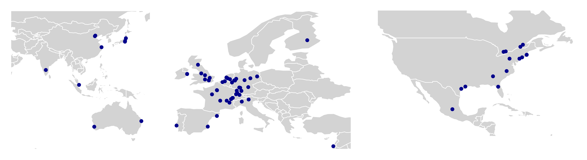

The digital rodent project aims to generate an in-silico model of the mouse and rat functional connectome using open-access fMRI dataset. 

We have curated and aggregated >3000 fMRI scans from mice and rats from ~50 participating [laboratories](./etc/geoplot/geoplot.md). We want to leverage this to generate accurate and representative in-silico models of the rodent functional connectome.

*Map of participating centers*

We want to use the normative model framework to create a trans-species framework to compare functional connectome features accross diagnostics

### Pre-registration
Place holeder for the pre-registration

### Proof of concept analysis
Place holder for the [demo analysis](./etc/demo/demo.md) using the mouse awake dataset. 

### Distribution and license.
This project is made available under the terms of the [Apache-2 license](LICENSE)

:x
