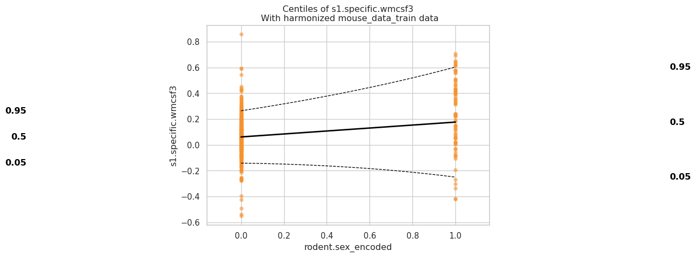
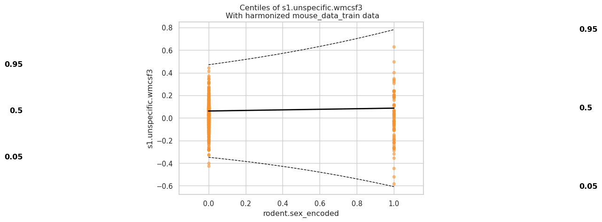
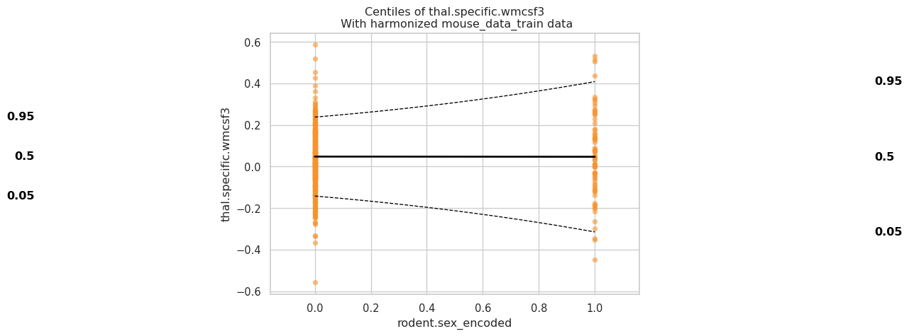
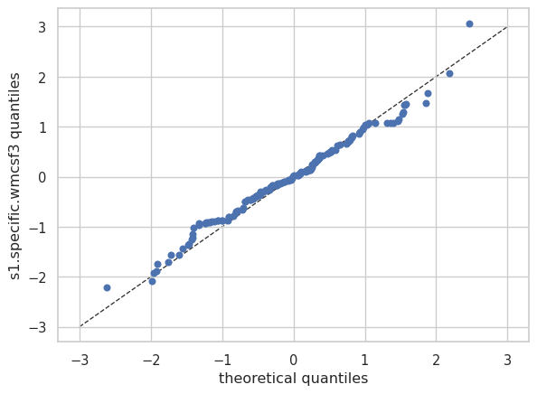
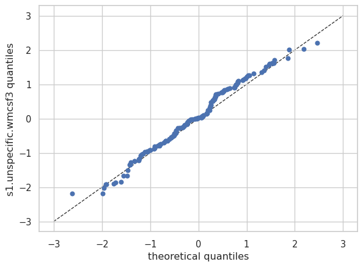
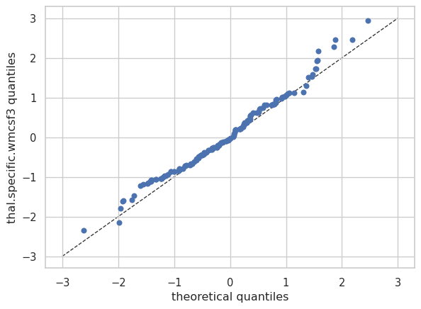

# Normative model demo
Joanes Grandjean
2026-02-12

Place holder for the normative model demo. Danny will pick it up.

See PCN installation and demo code at
https://pcntoolkit.readthedocs.io/en/latest/

See dataset at ./mouse_metadata_processed.tsv from the AwakeRodent
project

``` python
import warnings
import pandas as pd
import numpy as np
import matplotlib.pyplot as plt
from pcntoolkit import ( BLR, NormativeModel,NormData,plot_centiles,plot_qq,)
import pcntoolkit.util.output
import re

import seaborn as sns

sns.set_style("darkgrid")
warnings.simplefilter(action="ignore", category=FutureWarning)
pd.options.mode.chained_assignment = None  # default='warn'
pcntoolkit.util.output.Output.set_show_messages(False)

from pathlib import Path

# Use the current working directory where Quarto runs
current_dir = Path.cwd()  # Quarto's render directory
mouse_data_path = current_dir / "mouse_metadata_processed.tsv"

# Load Data
# mouse_data_path = '/home/dansch/Documents/digital_rodent/digitalrodent/etc/demo/mouse_metadata_processed.tsv'
mouse_df = pd.read_csv(mouse_data_path, sep='\t')


#Take wanted columsn 
mouse_df = mouse_df[
    [
        'rodent.sex',
        'rodent.strain',
        'main.experimenter.gender',
        'head-plate',
        'anesthesia.before.acquisition',
        'MRI.cryocoil',
        'fMRI.sequence',
        's1.specific.wmcsf3',
        's1.unspecific.wmcsf3',
        'thal.specific.wmcsf3'
    ]
]

#Encoding
# 'm' -> 0, 'f' -> 1
mouse_df['rodent.sex_encoded'] = mouse_df['rodent.sex'].map({'m': 0, 'f': 1}).astype('float64')
# 'm' -> 0, 'f' -> 1
mouse_df['main.experimenter.gender_encoded'] = mouse_df['main.experimenter.gender'].map({'m': 0, 'f': 1}).astype('float64')
# 'n' -> 0 , 'y' -> 1 
mouse_df['head-plate_encoded'] = mouse_df['head-plate'].map({'n': 0, 'y': 1}).astype('float64')
# 'n' -> 0, 'y' -> 1
mouse_df['anesthesia.before.acquisition_encoded'] = mouse_df['anesthesia.before.acquisition'].map({'n': 0, 'y': 1}).astype('float64')
# 'n' -> 0, 'y' -> 1
mouse_df['MRI.cryocoil_encoded'] = mouse_df['MRI.cryocoil'].map({'n': 0, 'y': 1}).astype('float64')
# Enumarated encoding strain
strain_map = {v: i for i, v in enumerate(mouse_df['rodent.strain'].dropna().unique())}
mouse_df['rodent.strain_encoded'] = mouse_df['rodent.strain'].map(strain_map).astype('float64')
# Enumarated encoding fMRI sequence
sequence_map = {v: i for i, v in enumerate(mouse_df['fMRI.sequence'].dropna().unique())}
mouse_df['fMRI.sequence_encoded'] = mouse_df['fMRI.sequence'].map(sequence_map).astype('float64')

mouse_df = mouse_df[
    [
        'rodent.sex_encoded',
        'rodent.strain_encoded',
        'main.experimenter.gender_encoded',
        'head-plate_encoded',
        'anesthesia.before.acquisition_encoded',
        'MRI.cryocoil_encoded',
        'fMRI.sequence_encoded',
        's1.specific.wmcsf3',
        's1.unspecific.wmcsf3',
        'thal.specific.wmcsf3'
    ]
]

display(mouse_df.head())

# Create an encoding table
sex_map = {'m': 0, 'f': 1}
experimenter_map = {'m': 0, 'f': 1}
headplate_map = {'n': 0, 'y': 1}
anesthesia_map = {'n': 0, 'y': 1}
cryocoil_map = {'n': 0, 'y': 1}

encoding_table = pd.concat([
    pd.DataFrame(sex_map.items(), columns=['category','encoding']).assign(variable='rodent.sex'),
    pd.DataFrame(experimenter_map.items(), columns=['category','encoding']).assign(variable='main.experimenter.gender'),
    pd.DataFrame(headplate_map.items(), columns=['category','encoding']).assign(variable='head-plate'),
    pd.DataFrame(anesthesia_map.items(), columns=['category','encoding']).assign(variable='anesthesia.before.acquisition'),
    pd.DataFrame(cryocoil_map.items(), columns=['category','encoding']).assign(variable='MRI.cryocoil'),
    pd.DataFrame(strain_map.items(), columns=['category','encoding']).assign(variable='rodent.strain'),
    pd.DataFrame(sequence_map.items(), columns=['category','encoding']).assign(variable='fMRI.sequence')
])

encoding_table = encoding_table[['variable','category','encoding']]

print(encoding_table)

# Define Covariates, Batch Effects, and Response Variables
covariates = [
    'rodent.sex_encoded',
    'main.experimenter.gender_encoded',    
    'rodent.strain_encoded',
    'head-plate_encoded',
    'anesthesia.before.acquisition_encoded',
    'MRI.cryocoil_encoded',
    'fMRI.sequence_encoded'      
              
]

batch_effects = [

]

response_vars = [
    's1.specific.wmcsf3',
    's1.unspecific.wmcsf3',
    'thal.specific.wmcsf3'
]

# Handle NaNs (this does remove the whole row even when one Nan is present)
all_relevant_columns = covariates + batch_effects + response_vars
mouse_df_cleaned = mouse_df.dropna(subset=all_relevant_columns).copy()

print(f"Original DataFrame shape: {mouse_df.shape}")
print(f"Cleaned DataFrame shape after dropping NaNs: {mouse_df_cleaned.shape}")
display(mouse_df_cleaned.head())

norm_data = NormData.from_dataframe(
    name="mouse_data",
    dataframe=mouse_df_cleaned,
    covariates=covariates,
    batch_effects=batch_effects,
    response_vars=response_vars,
    remove_Nan=False
)

print("\nNormData coordinates after cleaning and covariate update:")
print(norm_data.coords)

#Perform Reproducible Train-Test Split 
train, test = norm_data.train_test_split()

# Initialize and Fit Normative Model 
model = NormativeModel(BLR(heteroskedastic=True), inscaler="standardize", outscaler="standardize")
model.fit_predict(train, test)

# Generate Evaluation Plots and Statistics
plot_centiles(
    model,
    scatter_data=train,
    centiles=[0.05, 0.5, 0.95],
    covariate='rodent.sex_encoded', 
    scatter_kwargs={'s':30, 'alpha':0.6},
    
) 

# Show dataset statistics
print("\nTrain Set Statistics:")
display(train.get_statistics_df())
print("\nTest Set Statistics:")
display(test.get_statistics_df())

# QQ plot
plot_qq(test, plot_id_line=True)
```

<div>
<style scoped>
    .dataframe tbody tr th:only-of-type {
        vertical-align: middle;
    }
&#10;    .dataframe tbody tr th {
        vertical-align: top;
    }
&#10;    .dataframe thead th {
        text-align: right;
    }
</style>

|  | rodent.sex_encoded | rodent.strain_encoded | main.experimenter.gender_encoded | head-plate_encoded | anesthesia.before.acquisition_encoded | MRI.cryocoil_encoded | fMRI.sequence_encoded | s1.specific.wmcsf3 | s1.unspecific.wmcsf3 | thal.specific.wmcsf3 |
|----|----|----|----|----|----|----|----|----|----|----|
| 0 | 0.0 | 0.0 | 0.0 | 1.0 | 0.0 | 1.0 | 0.0 | 0.312149 | -0.013264 | -0.138054 |
| 1 | 0.0 | 0.0 | 0.0 | 1.0 | 0.0 | 1.0 | 0.0 | 0.249507 | 0.201358 | -0.081693 |
| 2 | 0.0 | 0.0 | 0.0 | 1.0 | 0.0 | 1.0 | 0.0 | 0.197713 | 0.130698 | -0.060385 |
| 3 | 0.0 | 0.0 | 0.0 | 1.0 | 0.0 | 1.0 | 0.0 | 0.353313 | -0.147183 | -0.081843 |
| 4 | 0.0 | 0.0 | 0.0 | 1.0 | 0.0 | 0.0 | 0.0 | 0.142680 | 0.056445 | 0.021758 |

</div>

                            variable     category  encoding
    0                     rodent.sex            m         0
    1                     rodent.sex            f         1
    0       main.experimenter.gender            m         0
    1       main.experimenter.gender            f         1
    0                     head-plate            n         0
    1                     head-plate            y         1
    0  anesthesia.before.acquisition            n         0
    1  anesthesia.before.acquisition            y         1
    0                   MRI.cryocoil            n         0
    1                   MRI.cryocoil            y         1
    0                  rodent.strain      C57BL/6         0
    1                  rodent.strain  129S2/SvPas         1
    2                  rodent.strain   F1 C6/129P         2
    3                  rodent.strain          ICR         3
    0                  fMRI.sequence       GE-EPI         0
    1                  fMRI.sequence       SE-EPI         1
    Original DataFrame shape: (1361, 10)
    Cleaned DataFrame shape after dropping NaNs: (768, 10)

<div>
<style scoped>
    .dataframe tbody tr th:only-of-type {
        vertical-align: middle;
    }
&#10;    .dataframe tbody tr th {
        vertical-align: top;
    }
&#10;    .dataframe thead th {
        text-align: right;
    }
</style>

|  | rodent.sex_encoded | rodent.strain_encoded | main.experimenter.gender_encoded | head-plate_encoded | anesthesia.before.acquisition_encoded | MRI.cryocoil_encoded | fMRI.sequence_encoded | s1.specific.wmcsf3 | s1.unspecific.wmcsf3 | thal.specific.wmcsf3 |
|----|----|----|----|----|----|----|----|----|----|----|
| 0 | 0.0 | 0.0 | 0.0 | 1.0 | 0.0 | 1.0 | 0.0 | 0.312149 | -0.013264 | -0.138054 |
| 1 | 0.0 | 0.0 | 0.0 | 1.0 | 0.0 | 1.0 | 0.0 | 0.249507 | 0.201358 | -0.081693 |
| 2 | 0.0 | 0.0 | 0.0 | 1.0 | 0.0 | 1.0 | 0.0 | 0.197713 | 0.130698 | -0.060385 |
| 3 | 0.0 | 0.0 | 0.0 | 1.0 | 0.0 | 1.0 | 0.0 | 0.353313 | -0.147183 | -0.081843 |
| 4 | 0.0 | 0.0 | 0.0 | 1.0 | 0.0 | 0.0 | 0.0 | 0.142680 | 0.056445 | 0.021758 |

</div>


    NormData coordinates after cleaning and covariate update:
    Coordinates:
      * observations       (observations) int64 6kB 0 1 2 3 4 ... 764 765 766 767
      * response_vars      (response_vars) <U20 240B 's1.specific.wmcsf3' ... 'th...
      * covariates         (covariates) <U37 1kB 'rodent.sex_encoded' ... 'fMRI.s...
      * batch_effect_dims  (batch_effect_dims) <U18 72B 'dummy_batch_effect'

    /home/traaffneu/dansch/.conda/envs/myenv/lib/python3.12/site-packages/pcntoolkit/regression_model/blr.py:674: LinAlgWarning: An ill-conditioned matrix detected: slice 0 has rcond = 1.9538264579314547e-17.
      invAXt: np.ndarray = linalg.solve(self.A, X.T, check_finite=False)
    /home/traaffneu/dansch/.conda/envs/myenv/lib/python3.12/site-packages/pcntoolkit/util/output.py:239: UserWarning: Process: 1227571 - 2026-03-12 14:47:50 - Estimation of posterior distribution failed due to: 
    Matrix is not positive definite
      warnings.warn(message)
    /home/traaffneu/dansch/.conda/envs/myenv/lib/python3.12/site-packages/pcntoolkit/regression_model/blr.py:674: LinAlgWarning: An ill-conditioned matrix detected: slice 0 has rcond = 2.4667632781583506e-17.
      invAXt: np.ndarray = linalg.solve(self.A, X.T, check_finite=False)
    /home/traaffneu/dansch/.conda/envs/myenv/lib/python3.12/site-packages/pcntoolkit/regression_model/blr.py:674: LinAlgWarning: An ill-conditioned matrix detected: slice 0 has rcond = 1.526580272650774e-17.
      invAXt: np.ndarray = linalg.solve(self.A, X.T, check_finite=False)
    /home/traaffneu/dansch/.conda/envs/myenv/lib/python3.12/site-packages/pcntoolkit/regression_model/blr.py:674: LinAlgWarning: An ill-conditioned matrix detected: slice 0 has rcond = 2.639559521846303e-17.
      invAXt: np.ndarray = linalg.solve(self.A, X.T, check_finite=False)
    /home/traaffneu/dansch/.conda/envs/myenv/lib/python3.12/site-packages/pcntoolkit/regression_model/blr.py:674: LinAlgWarning: An ill-conditioned matrix detected: slice 0 has rcond = 3.462182006655576e-17.
      invAXt: np.ndarray = linalg.solve(self.A, X.T, check_finite=False)
    /home/traaffneu/dansch/.conda/envs/myenv/lib/python3.12/site-packages/pcntoolkit/util/output.py:239: UserWarning: Process: 1227571 - 2026-03-12 14:47:50 - Estimation of posterior distribution failed due to: 
    A singular matrix detected: slice(s) [0] are singular.
      warnings.warn(message)
    /home/traaffneu/dansch/.conda/envs/myenv/lib/python3.12/site-packages/pcntoolkit/regression_model/blr.py:674: LinAlgWarning: An ill-conditioned matrix detected: slice 0 has rcond = 1.039483354706727e-17.
      invAXt: np.ndarray = linalg.solve(self.A, X.T, check_finite=False)
    /home/traaffneu/dansch/.conda/envs/myenv/lib/python3.12/site-packages/pcntoolkit/regression_model/blr.py:674: LinAlgWarning: An ill-conditioned matrix detected: slice 0 has rcond = 5.541604398903196e-18.
      invAXt: np.ndarray = linalg.solve(self.A, X.T, check_finite=False)
    /home/traaffneu/dansch/.conda/envs/myenv/lib/python3.12/site-packages/pcntoolkit/regression_model/blr.py:674: LinAlgWarning: An ill-conditioned matrix detected: slice 0 has rcond = 2.5158086621059984e-17.
      invAXt: np.ndarray = linalg.solve(self.A, X.T, check_finite=False)
    /home/traaffneu/dansch/.conda/envs/myenv/lib/python3.12/site-packages/pcntoolkit/util/plotter.py:209: UserWarning: Tight layout not applied. The left and right margins cannot be made large enough to accommodate all Axes decorations.
      plt.tight_layout()
    /home/traaffneu/dansch/.conda/envs/myenv/lib/python3.12/site-packages/pcntoolkit/util/plotter.py:209: UserWarning: Tight layout not applied. The left and right margins cannot be made large enough to accommodate all Axes decorations.
      plt.tight_layout()
    /home/traaffneu/dansch/.conda/envs/myenv/lib/python3.12/site-packages/pcntoolkit/util/plotter.py:209: UserWarning: Tight layout not applied. The left and right margins cannot be made large enough to accommodate all Axes decorations.
      plt.tight_layout()
    /home/traaffneu/dansch/.conda/envs/myenv/lib/python3.12/site-packages/pcntoolkit/util/plotter.py:209: UserWarning: Tight layout not applied. The left and right margins cannot be made large enough to accommodate all Axes decorations.
      plt.tight_layout()
    /home/traaffneu/dansch/.conda/envs/myenv/lib/python3.12/site-packages/pcntoolkit/util/plotter.py:209: UserWarning: Tight layout not applied. The left and right margins cannot be made large enough to accommodate all Axes decorations.
      plt.tight_layout()
    /home/traaffneu/dansch/.conda/envs/myenv/lib/python3.12/site-packages/pcntoolkit/util/plotter.py:209: UserWarning: Tight layout not applied. The left and right margins cannot be made large enough to accommodate all Axes decorations.
      plt.tight_layout()








    Train Set Statistics:

<div>
<style scoped>
    .dataframe tbody tr th:only-of-type {
        vertical-align: middle;
    }
&#10;    .dataframe tbody tr th {
        vertical-align: top;
    }
&#10;    .dataframe thead th {
        text-align: right;
    }
</style>

| statistic | EXPV | MACE | MAPE | MSLL | NLL | R2 | RMSE | Rho | Rho_p | SMSE | ShapiroW |
|----|----|----|----|----|----|----|----|----|----|----|----|
| response_vars |  |  |  |  |  |  |  |  |  |  |  |
| s1.specific.wmcsf3 | 0.191140 | 0.015114 | 2.532382 | 1.542873 | 1.238932 | 0.191127 | 0.160584 | 0.265037 | 2.494718e-11 | 0.808873 | 0.991224 |
| s1.unspecific.wmcsf3 | 0.022857 | 0.013160 | 1.905200 | 1.885878 | 1.336503 | 0.022854 | 0.138087 | 0.155728 | 1.068003e-04 | 0.977146 | 0.995678 |
| thal.specific.wmcsf3 | 0.033061 | 0.012378 | 2.546657 | 1.882320 | 1.357512 | 0.033056 | 0.140780 | 0.185479 | 3.713226e-06 | 0.966944 | 0.997224 |

</div>


    Test Set Statistics:

<div>
<style scoped>
    .dataframe tbody tr th:only-of-type {
        vertical-align: middle;
    }
&#10;    .dataframe tbody tr th {
        vertical-align: top;
    }
&#10;    .dataframe thead th {
        text-align: right;
    }
</style>

| statistic | EXPV | MACE | MAPE | MSLL | NLL | R2 | RMSE | Rho | Rho_p | SMSE | ShapiroW |
|----|----|----|----|----|----|----|----|----|----|----|----|
| response_vars |  |  |  |  |  |  |  |  |  |  |  |
| s1.specific.wmcsf3 | 0.183637 | 0.027792 | 1.772901 | 1.639580 | 1.126688 | 0.180324 | 0.131171 | 0.20728 | 0.009897 | 0.819676 | 0.989012 |
| s1.unspecific.wmcsf3 | 0.021016 | 0.014286 | 1.301528 | 1.871156 | 1.347228 | 0.020829 | 0.141792 | 0.01570 | 0.846756 | 0.979171 | 0.990153 |
| thal.specific.wmcsf3 | -0.064988 | 0.018182 | 1.384370 | 1.954994 | 1.323253 | -0.064998 | 0.132763 | -0.12591 | 0.119715 | 1.064998 | 0.986051 |

</div>






